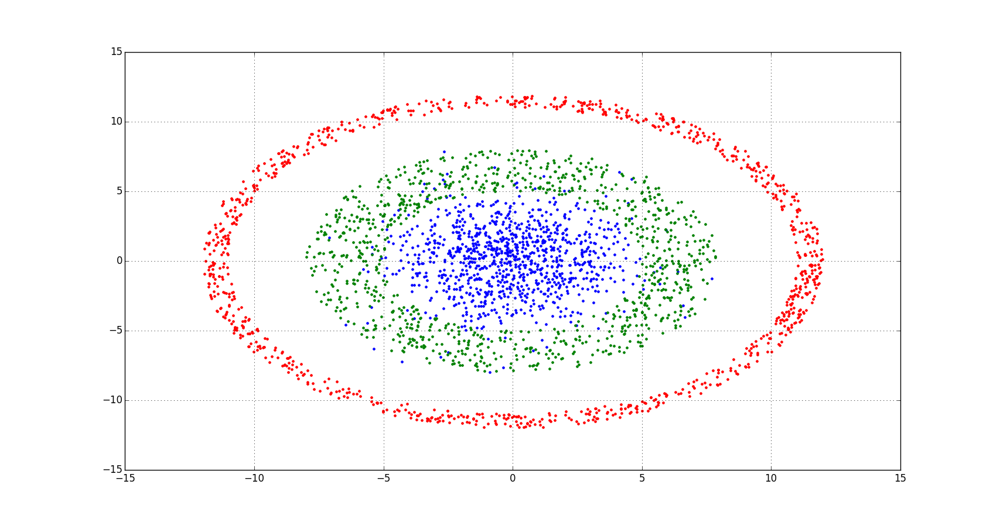
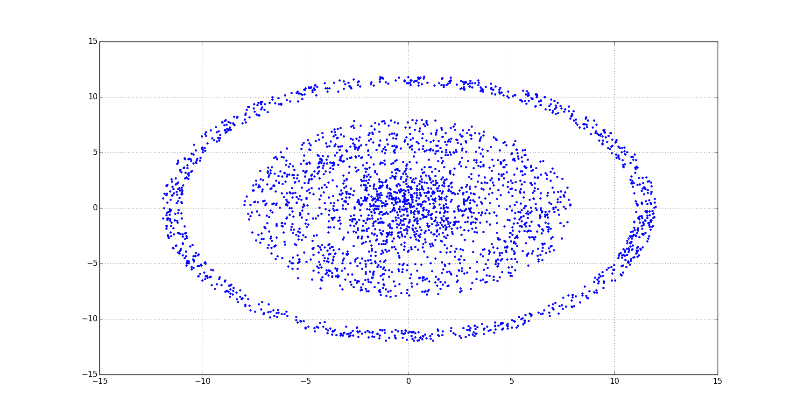
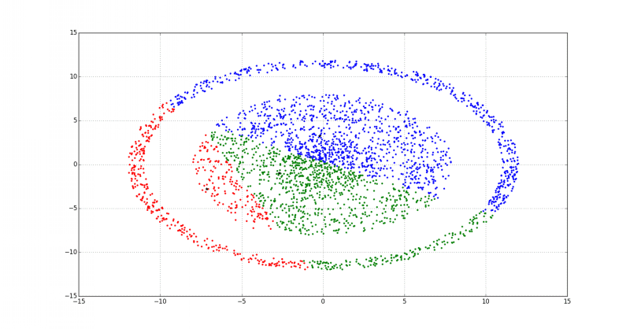
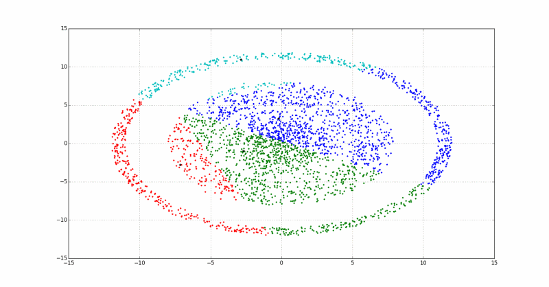
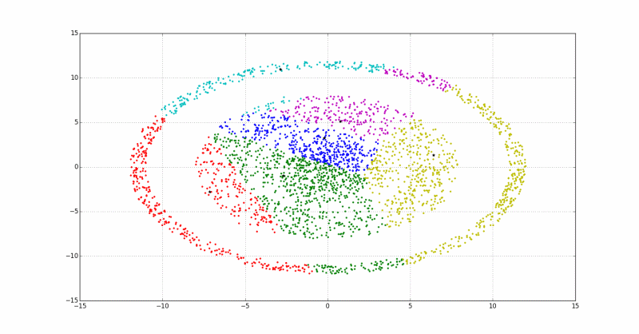
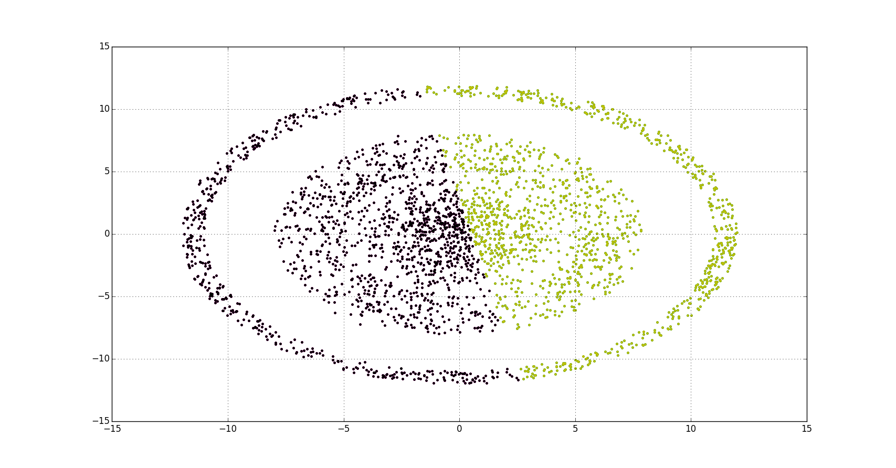
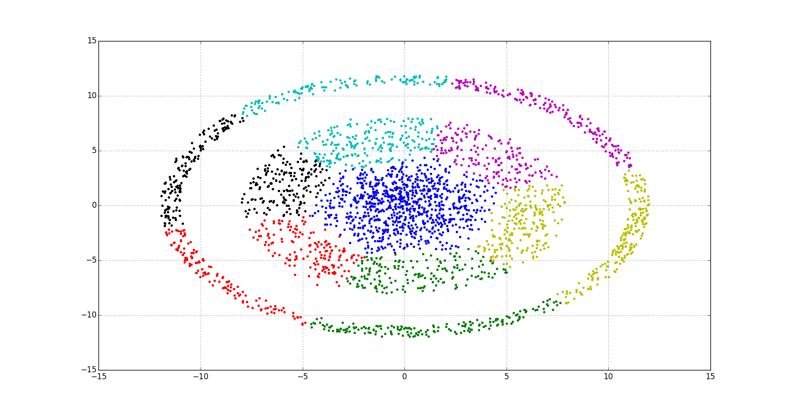

# K-Means clustering

## Description

Well, it's the most common method for clusterings.

>We are going to use this data from this [project](https://github.com/rcv911/Cluster_generation) but changing some parameters: 
>>So, we generated 3 clusters:

>>We have this data after permutation. Ok, we are ready to analys:


## Algorithm

+ The number of clusters has known already:
```python
	k = <number> # number of clusters
```
+ **step 0** - the starting guesses for the centers
```python
	z=x[:k,:].copy() ##step 0
```
+ ***Iteration procedure***
  + **step 1** - we need determinate the membership of points to the cluster
    + it's about min value of distances
  + **step 2** - centers correction
    + the coordinates of the centers is the arithmetic average of coordinates of points included in the cluster
  + **step3** - check. Have you changed the contents of points in the cluster
    + not changed - exit
	+ changed - go to step 1


## Results

> Note, black star on the animations means center of cluster

- if k = 3 


- if k = 4


- if k = 6


- Here some another results: if k = 2


- if k = 7


## Learn more

- [Wiki](https://en.wikipedia.org/wiki/K-means_clustering)
- from [Datascience.com](https://www.datascience.com/blog/k-means-clustering)
- [Microsoft](https://msdn.microsoft.com/en-us/library/azure/dn905944.aspx)

## Installation

You can use [Python](https://www.python.org/) with data package: [Anaconda](https://www.anaconda.com/) or [Miniconda](https://conda.io/miniconda).
There's another way - use [Portable Python](http://portablepython.com/). Also you can use whatever IDE for Python.

## License

Free
